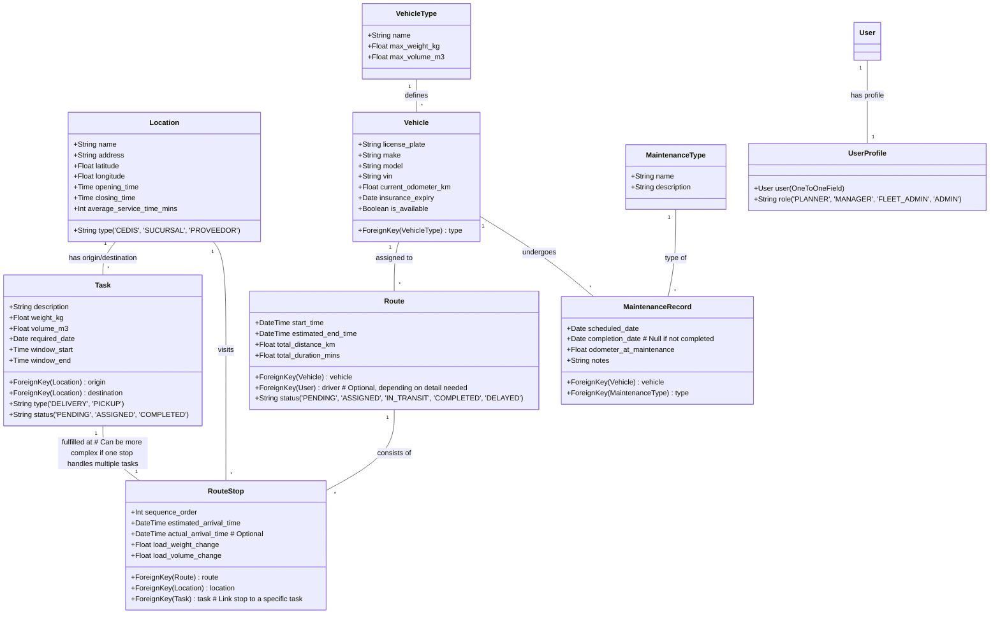

# VRP Application Development Plan

**Project Goal:** Develop a web-based Vehicle Routing Problem (VRP) application using Django and React, incorporating features for data management, route optimization (using Google OR-Tools and Google Maps API), route visualization, fleet maintenance, and user management.

**1. Project Setup & Structure:**

*   A new directory `vrp_django_react` will be created within the current workspace (`c:\Users\AGPCORPO\OneDrive\Escritorio\vrp-react-flask-project`).
*   The project will follow a standard separation of frontend and backend concerns:
    *   `vrp_django_react/backend/`: Contains the Django project and apps.
    *   `vrp_django_react/frontend/`: Contains the React application.
*   Initialize a Git repository within `vrp_django_react` for version control.

**2. Technology Stack:**

*   **Backend:** Python, Django, Django REST Framework (DRF), PostgreSQL (using `psycopg2-binary`), Google OR-Tools (`ortools`), Google Maps Services Python Client (`googlemaps`).
*   **Frontend:** React, JavaScript (or potentially TypeScript if preferred), a mapping library (like Leaflet with React-Leaflet, or Google Maps JavaScript API), a UI component library (e.g., Material UI, Ant Design for faster development), Axios (for API calls).
*   **Database:** PostgreSQL.

**3. High-Level Architecture:**

```mermaid
graph TD
    User[User Browser] --> FE[React Frontend];
    FE -->|API Calls (REST)| BE[Django Backend];
    BE --> DB[(PostgreSQL Database)];
    BE -->|VRP Calculation| GORT[Google OR-Tools];
    BE -->|Distance/Time Matrix| GMapsAPI[Google Maps API];

    subgraph "vrp_django_react/frontend"
        FE
    end

    subgraph "vrp_django_react/backend"
        BE
        GORT
        GMapsAPI
    end

    subgraph "Database Server"
        DB
    end
```

**4. Core Data Models (Illustrative - Django `models.py`):**


*(Note: This is a simplified representation. Relationships and fields might need refinement during implementation.)*

**5. Backend API Endpoints (Illustrative - DRF `urls.py` / `views.py`):**

*   `/api/auth/login/`, `/api/auth/logout/`, `/api/auth/user/`
*   `/api/locations/` (GET, POST), `/api/locations/<id>/` (GET, PUT, DELETE)
*   `/api/locations/import/` (POST - for CSV)
*   `/api/vehicle_types/`, `/api/vehicle_types/<id>/`
*   `/api/vehicles/`, `/api/vehicles/<id>/`
*   `/api/tasks/`, `/api/tasks/<id>/`
*   `/api/routes/` (GET - list planned routes)
*   `/api/routes/<id>/` (GET - details, PUT - update status)
*   `/api/routes/plan/` (POST - triggers VRP calculation, requires tasks, vehicles, date, constraints)
*   `/api/maintenance_types/`, `/api/maintenance_types/<id>/`
*   `/api/maintenance_records/`, `/api/maintenance_records/<id>/`
*   `/api/users/`, `/api/users/<id>/` (Admin only)

**6. Frontend Components (Illustrative - React):**

*   **Pages/Views:** `LoginPage`, `DashboardPage`, `LocationsPage`, `VehiclesPage`, `TasksPage`, `RoutePlanningPage`, `RouteTrackingPage`, `FleetMaintenancePage`, `UserManagementPage`.
*   **Shared Components:** `AppLayout` (with navigation), `DataTable`, `MapComponent` (using Leaflet/Google Maps), `KanbanBoard`, `ConfirmationModal`, `LoadingSpinner`.
*   **Feature Components:** `LocationForm`, `VehicleForm`, `TaskForm`, `RoutePlannerForm` (select date, tasks, vehicles), `RouteMapDisplay`, `KanbanCard`, `MaintenanceScheduler`.
*   **Services:** `authService`, `apiService` (wrappers around Axios for different endpoints).

**7. Implementation Phases:**

*   **Phase 1: Foundation (Sprint 1-2)**
    *   Setup project structure (`vrp_django_react`, Django project, React app).
    *   Setup PostgreSQL database.
    *   Implement User model, UserProfile (Roles), Authentication API (Login/Logout).
    *   Implement Location, VehicleType, Vehicle models, basic CRUD APIs, and corresponding simple frontend tables/forms.
    *   Basic map component showing locations.
*   **Phase 2: Core VRP & Planning UI (Sprint 3-4)**
    *   Integrate Google OR-Tools library into Django.
    *   Develop backend VRP service: Takes tasks, vehicles, locations; uses Google Maps API for distance/time matrix; applies capacity constraints; returns route sequences.
    *   Implement Task model, CRUD API, and frontend form.
    *   Create `/api/routes/plan/` endpoint.
    *   Develop frontend Route Planning UI: Select date, available vehicles, pending tasks; trigger planning endpoint.
    *   Implement Route and RouteStop models. Store planned routes.
    *   Enhance map component to display calculated routes (polylines, markers with sequence).
*   **Phase 3: Advanced Constraints & Visualization (Sprint 5-6)**
    *   Refine VRP service: Add time windows, max route duration, driver breaks.
    *   Handle different task types (Pickup, Delivery, Mixed) in VRP logic and data models if needed.
    *   Develop Kanban board component in React.
    *   Implement API endpoints to fetch routes by status and update status.
    *   Connect Kanban board to API.
    *   Implement CSV import functionality for Locations (backend endpoint + frontend upload UI).
    *   Add interactivity to map (click stops/locations for details).
*   **Phase 4: Fleet Management & Roles (Sprint 7-8)**
    *   Implement MaintenanceType, MaintenanceRecord models, CRUD APIs, and frontend UI.
    *   Develop logic for scheduling maintenance (manual + alerts based on date/estimated mileage).
    *   Implement logic to update vehicle odometer based on completed route distances.
    *   Implement vehicle availability flag and link it to maintenance status.
    *   Refine frontend based on user roles (show/hide sections, disable actions).
    *   Implement User Management UI (for Admin role).
*   **Phase 5: Testing, Polish & Future Prep (Sprint 9+)**
    *   Write unit tests (Django) and component/integration tests (React).
    *   End-to-end testing.
    *   UI/UX refinement based on feedback.
    *   Add comprehensive documentation (READMEs, API docs).
    *   Review API design for potential future ERP integration (e.g., dedicated endpoint for receiving demand).