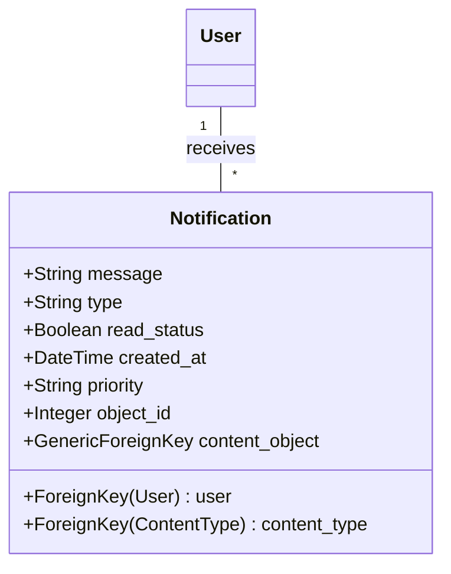

# VRP Application Development Plan

**Project Goal:** Develop a web-based Vehicle Routing Problem (VRP) application using Django and React, incorporating features for data management, route optimization (using Google OR-Tools and Google Maps API), route visualization, fleet maintenance, and user management.

**1. Project Setup & Structure:**

*   ✅ A new directory `vrp_django_react` will be created within the current workspace (`c:\Users\AGPCORPO\OneDrive\Escritorio\vrp-react-flask-project`).
*   ✅ The project will follow a standard separation of frontend and backend concerns:
    *   ✅ `vrp_django_react/backend/`: Contains the Django project and apps.
    *   ✅ `vrp_django_react/frontend/`: Contains the React application.
*   ✅ Initialize a Git repository within `vrp_django_react` for version control.

**2. Technology Stack:**

*   ✅ **Backend:** Python, Django, Django REST Framework (DRF), PostgreSQL (using `psycopg2-binary`), Google OR-Tools (`ortools`), Google Maps Services Python Client (`googlemaps`).
*   ✅ **Frontend:** React, JavaScript (or potentially TypeScript if preferred), a mapping library (like Leaflet with React-Leaflet, or Google Maps JavaScript API), a UI component library (e.g., Material UI, Ant Design for faster development), Axios (for API calls).
*   **Database:** PostgreSQL. *(Actualmente usando SQLite)*

**3. High-Level Architecture:**

```mermaid
graph TD
    User[User Browser] --> FE[React Frontend];
    FE -->|API Calls (REST)| BE[Django Backend];
    BE --> DB[(PostgreSQL Database)];
    BE -->|VRP Calculation| GORT[Google OR-Tools];
    BE -->|Distance/Time Matrix| GMapsAPI[Google Maps API];

    subgraph "vrp_django_react/frontend"
        FE
    end

    subgraph "vrp_django_react/backend"
        BE
        GORT
        GMapsAPI
    end

    subgraph "Database Server"
        DB
    end
```

**4. Core Data Models (Illustrative - Django `models.py`):**


*(Note: This is a simplified representation. Relationships and fields might need refinement during implementation.)*

**5. Backend API Endpoints (Illustrative - DRF `urls.py` / `views.py`):**

*   ✅ `/api/auth/login/`, `/api/auth/logout/`, `/api/auth/user/`
*   ✅ `/api/locations/` (GET, POST), `/api/locations/<id>/` (GET, PUT, DELETE)
*   ✅ `/api/locations/import/` (POST - for CSV)
*   ✅ `/api/vehicle_types/`, `/api/vehicle_types/<id>/`
*   ✅ `/api/vehicles/`, `/api/vehicles/<id>/`
*   ✅ `/api/tasks/`, `/api/tasks/<id>/`
*   ✅ `/api/routes/` (GET - list planned routes)
*   ✅ `/api/routes/<id>/` (GET - details, PUT - update status)
*   ✅ `/api/routes/plan/` (POST - triggers VRP calculation, requires tasks, vehicles, date, constraints)
*   ✅ `/api/maintenance_types/`, `/api/maintenance_types/<id>/`
*   ✅ `/api/maintenance_records/`, `/api/maintenance_records/<id>/`
*   ✅ `/api/users/`, `/api/users/<id>/` (Admin only)

**6. Frontend Components (Illustrative - React):**

*   **Pages/Views:** 
    * ✅ `LoginPage`
    * ✅ `DashboardPage`
    * ✅ `LocationsPage`
    * ✅ `VehiclesPage`
    * ✅ `TasksPage`
    * ✅ `RoutePlanningPage`
    * ✅ `RouteTrackingPage` (implementado como KanbanBoard)
    * ✅ `FleetMaintenancePage`
    * ✅ `UserManagementPage`
*   **Shared Components:** 
    * ✅ `AppLayout` (with navigation)
    * ✅ `DataTable`
    * ✅ `MapComponent` (using Leaflet/Google Maps)
    * ✅ `KanbanBoard`
    * ✅ `ConfirmationModal`
    * ✅ `LoadingSpinner`
*   **Feature Components:** 
    * ✅ `LocationForm`
    * ✅ `VehicleForm`
    * ✅ `TaskForm`
    * ✅ `RoutePlannerForm` (select date, tasks, vehicles)
    * ✅ `RouteMapDisplay`
    * ✅ `KanbanCard`
    * ✅ `MaintenanceScheduler`
*   **Services:** 
    * ✅ `authService`
    * ✅ `apiService` (wrappers around Axios for different endpoints)

**7. Implementation Phases:**

*   **Phase 1: Foundation (Sprint 1-2)**
    *   ✅ Setup project structure (`vrp_django_react`, Django project, React app).
    *   ✅ Setup PostgreSQL database. *(Se usa SQLite actualmente)*
    *   ✅ Implement User model, UserProfile (Roles), Authentication API (Login/Logout).
    *   ✅ Implement Location, VehicleType, Vehicle models, basic CRUD APIs, and corresponding simple frontend tables/forms.
    *   ✅ Basic map component showing locations.
*   **Phase 2: Core VRP & Planning UI (Sprint 3-4)**
    *   ✅ Integrate Google OR-Tools library into Django.
    *   ✅ Develop backend VRP service: Takes tasks, vehicles, locations; uses Google Maps API for distance/time matrix; applies capacity constraints; returns route sequences.
    *   ✅ Implement Task model, CRUD API, and frontend form.
    *   ✅ Create `/api/routes/plan/` endpoint.
    *   ✅ Develop frontend Route Planning UI: Select date, available vehicles, pending tasks; trigger planning endpoint.
    *   ✅ Implement Route and RouteStop models. Store planned routes.
    *   ✅ Enhance map component to display calculated routes (polylines, markers with sequence).
*   **Phase 3: Advanced Constraints & Visualization (Sprint 5-6)**
    *   ✅ Refine VRP service: Add time windows, max route duration, driver breaks.
    *   ✅ Handle different task types (Pickup, Delivery, Mixed) in VRP logic and data models if needed.
    *   ✅ Develop Kanban board component in React.
    *   ✅ Implement API endpoints to fetch routes by status and update status.
    *   ✅ Connect Kanban board to API.
    *   ✅ Implement CSV import functionality for Locations (backend endpoint + frontend upload UI).
    *   ✅ Add interactivity to map (click stops/locations for details).
*   **Phase 4: Fleet Management & Roles (Sprint 7-8)**
    *   ✅ Implement MaintenanceType, MaintenanceRecord models, CRUD APIs, and frontend UI.
    *   ✅ Develop logic for scheduling maintenance (manual + alerts based on date/estimated mileage).
    *   ✅ Implement logic to update vehicle odometer based on completed route distances.
    *   ✅ Implement vehicle availability flag and link it to maintenance status.
    *   ✅ Refine frontend based on user roles (show/hide sections, disable actions).
    *   ✅ Implement User Management UI (for Admin role).
*   **Phase 5: Testing, Polish & Future Prep (Sprint 9+)**
    *   Write unit tests (Django) and component/integration tests (React).
    *   End-to-end testing.
    *   UI/UX refinement based on feedback.
    *   Add comprehensive documentation (READMEs, API docs).
    *   Review API design for potential future ERP integration (e.g., dedicated endpoint for receiving demand).

**8. Sistema de Notificaciones:**

**Tipos de notificaciones relevantes:**
*   Alertas de mantenimiento de vehículos próximo a vencer
*   Notificaciones de rutas completadas o con retrasos
*   Avisos de tareas sin asignar o próximas a vencer
*   Alertas de conflictos en la planificación de rutas

**Arquitectura propuesta:**
*   **Backend:** Implementar un servicio de notificaciones en Django que almacene y gestione las notificaciones
*   **Frontend:** Mejorar el componente existente de notificaciones con un sistema de dropdown

**Implementación técnica:**


**Nuevos Endpoints API:**
*   `/api/notifications/` (GET - listar notificaciones para el usuario actual)
*   `/api/notifications/<id>/read/` (PUT - marcar como leída)
*   `/api/notifications/read-all/` (PUT - marcar todas como leídas)
*   `/api/notifications/count/` (GET - obtener conteo de no leídas)

**Implementación en Frontend:**
*   Expandir componente de notificaciones existente con panel desplegable
*   Implementar conexión WebSocket para notificaciones en tiempo real
*   Añadir componente de filtrado por prioridad/tipo

**Priorización de notificaciones:**
*   **Alta:** Problemas de mantenimiento críticos y conflictos en rutas programadas
*   **Media:** Tareas sin asignar con plazos cercanos
*   **Baja:** Actualizaciones informativas del sistema

**Integración con otras funcionalidades:**
*   Generar notificaciones automáticas desde eventos del sistema (cambios de estado de ruta, próximos mantenimientos)
*   Permitir notificaciones manuales desde administradores a grupos de usuarios específicos
*   Posibilidad de envío de notificaciones por correo electrónico para alertas de alta prioridad

**9. Funcionalidades Pendientes:**

**1. Operaciones y Seguimiento en Tiempo Real:**
*   **Seguimiento GPS en Vivo**: Implementar rastreo en tiempo real de los vehículos mediante dispositivos GPS para saber exactamente dónde está cada vehículo en todo momento.
*   **Aplicación Móvil para Conductores**: Desarrollar una aplicación dedicada para conductores que permita:
    *   Recibir rutas y detalles de paradas.
    *   Actualizar el estado de las entregas/recogidas (en camino, llegado, completado).
    *   Navegación GPS integrada hacia la siguiente parada.
    *   Captura de Prueba de Entrega (Proof of Delivery - POD): firmas electrónicas, fotos, notas.
    *   Comunicación bidireccional con el despachador/planificador.
    *   Reportar problemas o retrasos.
*   **Re-optimización Dinámica**: Implementar capacidad de ajustar rutas en tiempo real debido a tráfico, cancelaciones de último minuto, nuevas órdenes urgentes o averías de vehículos.
*   **Geocercas (Geofencing)**: Crear zonas virtuales y recibir alertas cuando los vehículos entran o salen de ellas (ej. llegada a cliente, salida del almacén).
*   **ETAs Precisas y Dinámicas**: Calcular y actualizar los Tiempos Estimados de Llegada (ETA) basados en la posición real y el tráfico, no solo en la planificación inicial.

**2. Planificación y Optimización Avanzada:**
*   **Algoritmos más Sofisticados**: Implementar motores de optimización que manejen restricciones complejas como:
    *   Múltiples ventanas horarias por cliente.
    *   Compatibilidad vehículo-carga-cliente.
    *   Habilidades requeridas del conductor.
    *   Prioridades de clientes/entregas.
    *   Rutas multi-depósito.
    *   Recogidas y entregas simultáneas (Backhauls).
    *   Descansos obligatorios del conductor (HOS - Hours of Service).
*   **Planificación de Escenarios ("What-If")**: Desarrollar funcionalidad para simular diferentes escenarios (ej. añadir vehículos, cerrar almacenes) para tomar decisiones estratégicas.
*   **Optimización de Carga**: Integrar algoritmos para optimizar cómo se carga la mercancía en el vehículo (secuenciación, optimización 3D del espacio).
*   **Gestión de Territorios**: Implementar herramientas para definir y balancear territorios de entrega entre vehículos o conductores.

**3. Gestión de Conductores y Cumplimiento:**
*   **Gestión de Horas de Servicio (HOS)**: Desarrollar seguimiento detallado del tiempo de conducción y descanso para cumplir con las regulaciones.
*   **Monitorización del Comportamiento del Conductor**: Integrar con telemática para rastrear hábitos como excesos de velocidad, frenadas bruscas, ralentí excesivo, para seguridad y eficiencia.
*   **Gestión de Documentación del Conductor**: Implementar seguimiento de licencias, certificaciones y documentos del conductor.

**4. Interacción con el Cliente:**
*   **Notificaciones Proactivas al Cliente**: Desarrollar sistema de envío automático de SMS/emails a los clientes con ETAs, enlaces de seguimiento en vivo y notificaciones de entrega completada.
*   **Portal de Cliente**: Crear un portal donde los clientes finales puedan ver el estado de sus entregas o solicitar servicios.
*   **Recopilación de Feedback**: Implementar módulos para recoger la satisfacción del cliente tras la entrega.

**5. Analítica e Informes Avanzados:**
*   **Dashboards Personalizables y KPIs Detallados**: Expandir más allá de "estadísticas generales" a dashboards donde los usuarios puedan definir y visualizar KPIs clave (costo por km, entregas a tiempo, utilización de vehículos).
*   **Informes Históricos y Personalizables**: Desarrollar capacidad de generar informes detallados sobre rendimiento pasado, comparar periodos, y personalizar qué datos incluir.
*   **Análisis de Costos**: Implementar desglose detallado de los costos operativos de las rutas (combustible estimado/real, mano de obra, mantenimiento).
*   **Análisis de Combustible**: Añadir seguimiento del consumo, eficiencia (MPG/KPL), e integración con tarjetas de combustible.

**6. Integraciones:**
*   **APIs Robustas**: Desarrollar capacidad de integrarse fácilmente con otros sistemas empresariales como ERP (para órdenes y facturación), WMS (Warehouse Management Systems - para disponibilidad de stock), CRM, sistemas de contabilidad, plataformas de e-commerce.
*   **Integración con Proveedores de Mapas Avanzados**: Implementar funcionalidades avanzadas de Google Maps, HERE, Mapbox, como cálculo de rutas con tráfico en tiempo real, matrices de distancias/tiempos complejas, geocodificación de alta precisión.
*   **Integración Hardware Telemático**: Añadir conectividad con diversos dispositivos GPS y sensores del vehículo.

**7. Gestión de Flota y Mantenimiento Avanzado:**
*   **Mantenimiento Preventivo**: Implementar programación automática de mantenimientos basada en kilometraje, horas de uso o tiempo.
*   **Gestión de Inventario de Repuestos**: Añadir control de stock de piezas para mantenimiento.
*   **Inspecciones de Vehículos (DVIR)**: Desarrollar módulos para que los conductores realicen inspecciones digitales antes/después del viaje.
*   **Gestión de Combustible**: Implementar registro detallado de repostajes y análisis de rendimiento.

**8. Funcionalidades Financieras:**
*   **Cálculo de Costos de Ruta**: Añadir estimación y registro de los costos asociados a cada ruta planificada/ejecutada.
*   **Soporte para Facturación**: Implementar generación de datos o facturas basadas en las entregas realizadas.